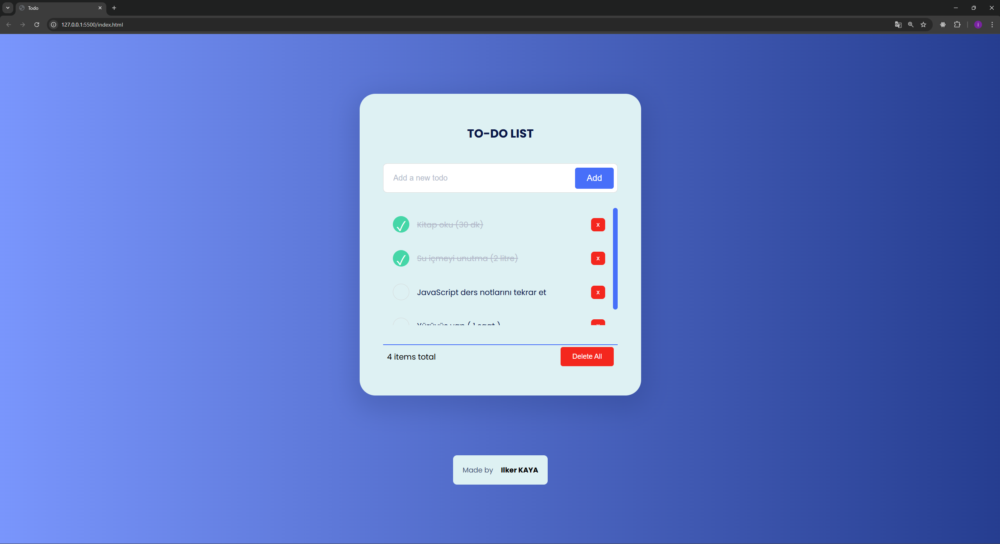

# 📝 To-Do List App

Basit, hızlı ve **responsive** bir yapılacaklar listesi uygulaması.  
Tarayıcı üzerinde çalışır ve veriler **LocalStorage** sayesinde kaybolmaz.

## 🚀 Özellikler

- ✅ Yeni görev ekleme
- ✅ Görevleri tamamlama / geri alma
- ✅ Görev düzenleme
- ✅ Tek tek silme veya tümünü silme
- ✅ LocalStorage ile kalıcı kayıt
- ✅ Responsive tasarım (mobil uyumlu)

## 📸 Ekran Görüntüsü

## 🛠️ Kullanılan Teknolojiler

- **HTML5**
- **CSS3**
- **JavaScript (ES6)**
- **LocalStorage API**

## 📂 Kurulum

git clone https://github.com/ilkerkayaa/To_do_list.git

cd todo-list-app

## Kullanım

 **Görev Ekleme**
   - Üst kısımdaki input alanına yapılacak görevi yaz.  
   - Klavyeden **Enter** tuşuna basabilir veya sağdaki **Add** butonuna tıklayabilirsin.  
   - Yazdığın görev listeye eklenecek.  

 **Görev Tamamlama**
   - Listenin sol tarafındaki kutucuğu işaretlediğinde görev tamamlanmış sayılır.  
   - Tamamlanan görevler gri renkte ve üzeri çizili olarak gösterilir.  
   - Kutucuğun işaretini kaldırarak görevi tekrar aktif hale getirebilirsin.  

**Görev Düzenleme**
   - Bir görevin üzerine **tıklayarak düzenleme moduna** geçebilirsin.  
   - Görev metnini değiştirip **Enter** ile kaydedebilir veya kutunun dışına tıklayabilirsin.  

**Görev Silme**
   - Her görevin sağ tarafında bulunan kırmızı **x** butonuna basarak yalnızca o görevi silebilirsin.  

**Tümünü Silme**
   - Listenin altındaki **Delete All** butonuna basarak tüm görevleri tek seferde silebilirsin.  

**Görev Sayısı**
   - Listenin altında toplam kaç görev olduğunu gösteren bir sayaç bulunur.  

 **Kalıcı Kayıt (LocalStorage)**
   - Tüm görevler tarayıcıda **LocalStorage** kullanılarak saklanır.  
   - Sayfayı kapatsan bile liste kaybolmaz, tekrar açtığında aynı görevleri görebilirsin.

## 📱 Responsive Tasarım

- 💻 Masaüstü için geniş düzen
- 📱 Mobil cihazlarda kaydırma ve boşluk ayarları

